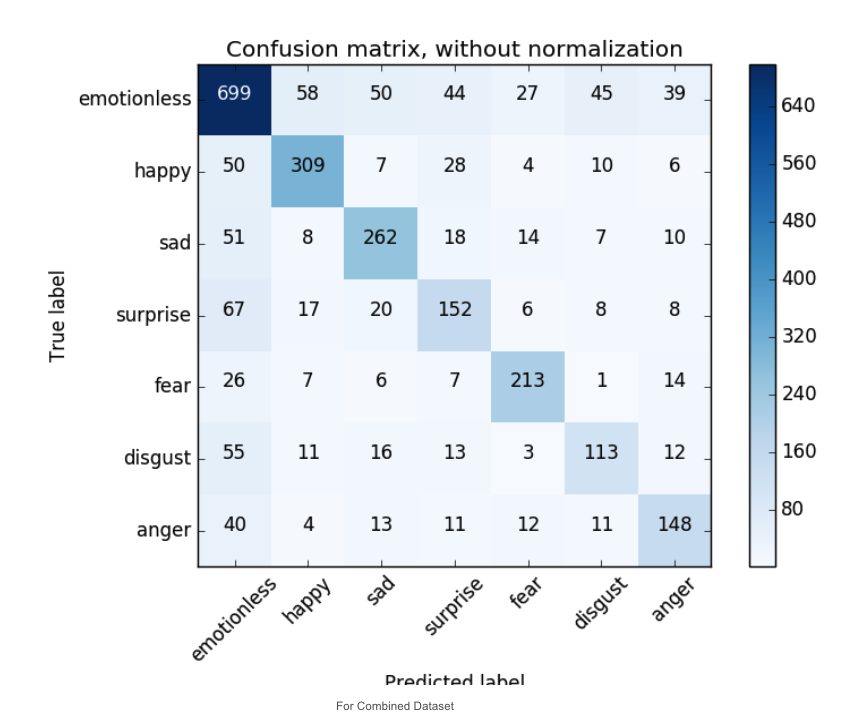
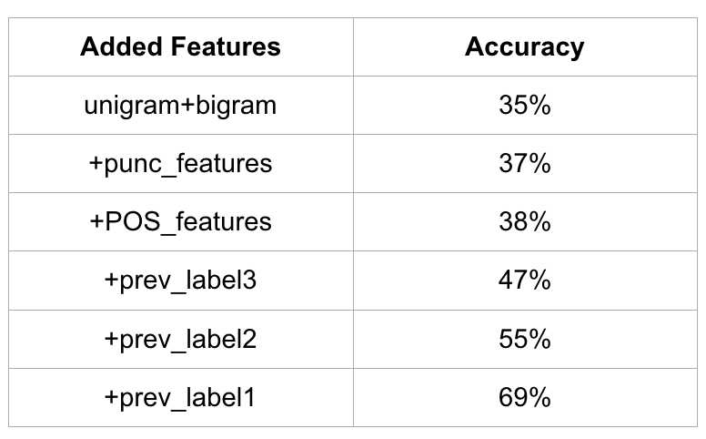
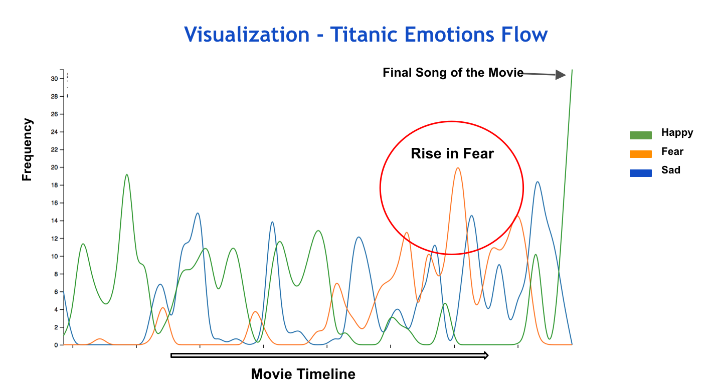
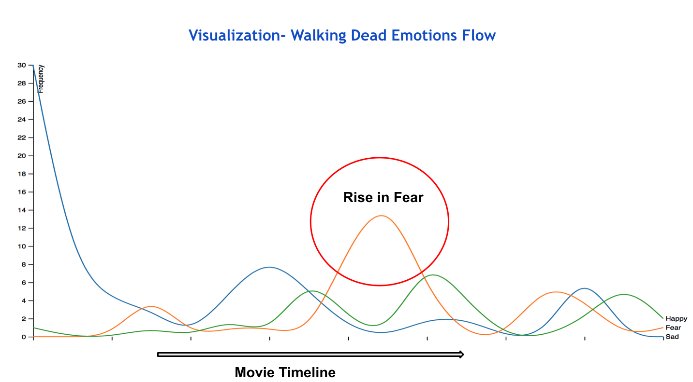
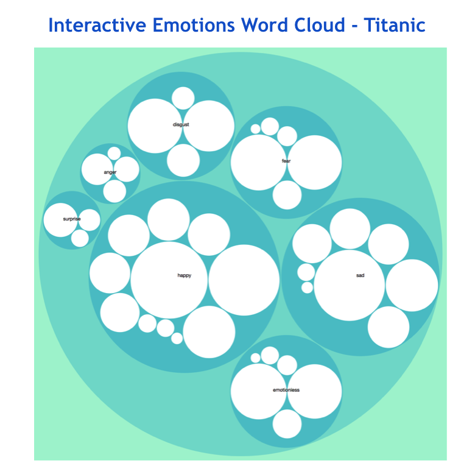

# movies_sentiment_analysis

GOAL: Automatically predict the emotion flow in videos using textual features.

IDEA: Subtitles are parallelly aligned to the scenes. Use the subtitle text to predict the emotion of a scene.

APPROACH: Develop an automatic classification model for identifying emotions in each scene. 

**Confusion Matrix**

**Prediction Accuracy for Features**

**Flow of Emotions on Timeline**

**Emotion Cloud**

[Link to the Paper](https://github.com/niteshsurtani/movies_sentiment_analysis/blob/master/NLP_Final_Paper.pdf)

[Link to the Presentation](https://github.com/niteshsurtani/movies_sentiment_analysis/blob/master/NLP%20Project%20PPT.pptx)
